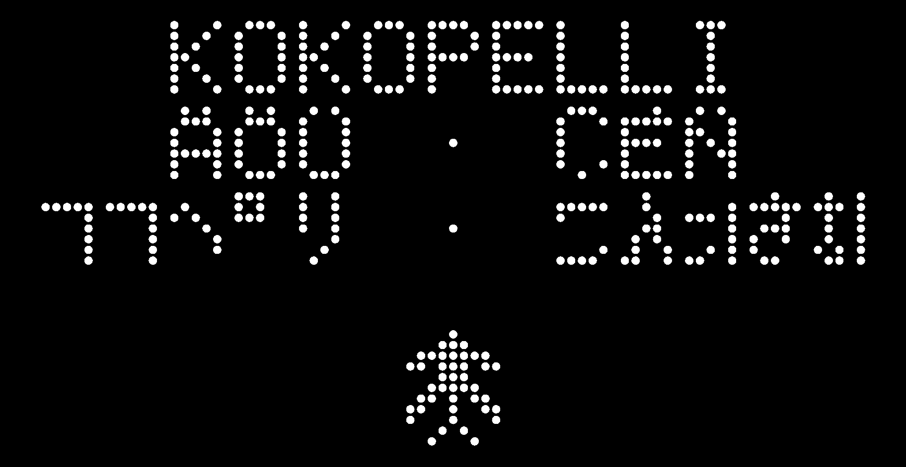

# Kokopelli Reloaded

Kokopelli is a script-based CAD/CAM environment that uses Python as a hardware
description language. Designs are ordinary Python programs: geometry can be
parameterized, composed, rendered, and prepared for fabrication without leaving
the editor.



This fork revives Kokopelli on modern Python while preserving the direct,
fabrication-oriented workflow built around its native implicit-geometry engine,
`libfab`.

## Why Kokopelli

- **Code is the model.** A `.ko` design is readable Python, with variables,
  functions, repetition, and composition.
- **Implicit geometry.** Shapes are combined as mathematical fields rather than
  fragile boundary meshes.
- **Interactive editing.** The wxPython editor provides a live 2D canvas,
  draggable points, and parameter sliders.
- **Fabrication-aware features.** Geometry can be defined from physical tool
  dimensions, including cutter-aware dot-matrix text and arbitrary pixel art.
- **Useful output.** The current revival verifies 16-bit heightmap PNG,
  multicolor PNG, and physically sized SVG export.

## Quick start on macOS

Install the build dependencies with [Homebrew](https://brew.sh):

```bash
brew install cmake libpng uv
```

Then clone, install, and launch Kokopelli:

```bash
git clone https://github.com/TheBeachLab/kokopelli.git
cd kokopelli
make install
uv run kokopelli
```

Open a bundled example by passing its `.ko` file:

```bash
uv run kokopelli examples/mandala.ko
uv run kokopelli examples/gear.ko
uv run kokopelli examples/dottext.ko
```

## Write a design

A design assigns one or more shapes to `cad`:

```python
from koko.lib.shapes import *

outer = circle(0, 0, 1)
inner = circle(0, 0, 0.45)

ring = outer - inner
ring.color = "red"

cad.shapes = [ring]
```

The [`examples`](examples) directory includes 2D and 3D models, parameterized
designs, text, PCB layouts, and mechanical assemblies. `mandala.ko`, `gear.ko`,
and `box.ko` are good introductions to the script-and-canvas workflow.

## Cutter-aware dot-matrix text

`koko.lib.dottext` constructs labels from physical dots rather than external
font outlines. Dot diameter can match a milling cutter, while edge-to-edge dot
clearance and character spacing remain independent:

```python
from koko.lib.dottext import text

label = text(
    "KOKOPELLI\nÄÖÜ · ココペリ",
    dot_diameter=0.8,
    dot_spacing=0.25,
    horizontal_spacing=1,
    vertical_spacing=1,
)

cad.mm_per_unit = 1
cad.shapes = [label]
```

Horizontal and vertical character spacing count empty matrix columns and rows.
The conventional default is one; zero places 5×7 cells directly beside one
another for continuous double-width or double-height patterns.

The map covers printable IBM-850 multilingual Latin-1, common European Latin
Extended-A letters, JIS X 0201 half-width katakana, full-width katakana input,
and a compact hiragana set. A 5×7 cell is not sufficient for general kanji. The
sources are documented in [`THIRD_PARTY_NOTICES.md`](THIRD_PARTY_NOTICES.md).

Arbitrary binary matrices use the same physical controls:

```python
from koko.lib.dottext import pattern

art = pattern(
    (
        "00100",
        "01110",
        "11111",
        "01010",
    ),
    dot_diameter=1.0,
    dot_spacing=0.3,
)
```

Open `examples/dottext.ko` to adjust cutter diameter, dot clearance, and both
character-spacing axes with interactive sliders.

## Current status

The current checkout verifies:

- Python 3.12, with declared support for Python 3.10 and newer;
- reproducible dependencies through `pyproject.toml` and `uv.lock`;
- native `libfab` compilation with current CMake and Apple Clang;
- the wxPython Phoenix editor and 2D canvas;
- all bundled `.ko` examples, including interactive points and sliders;
- the dot-matrix and export capabilities described above; and
- a self-contained Apple Silicon macOS app, Developer ID signing,
  notarization, ticket stapling, Gatekeeper validation, and a
  drag-to-Applications DMG.

3D rendering, STL/ASDF workflows, CAM machine output, and cross-platform builds
still require direct validation. Their presence in the source tree is not a
claim that they currently work. Verified evidence and the staged roadmap live
in [`REVIVAL.md`](REVIVAL.md).

## Development and verification

Build the native geometry library and check the runtime dependencies:

```bash
make check
```

Run the automated suite:

```bash
make test
```

Create and validate a self-contained local macOS application:

```bash
make app
make app-check
open dist/Kokopelli.app
```

The bundle contains Python, wxPython, OpenGL support, `libfab`, examples,
documentation, and the editable Kokopelli library sources. It registers `.ko`
as a Kokopelli design format and uses an ad hoc signature for local builds.

Developer ID signing, unattended API authentication, Apple notarization, ZIP
archives, and the graphical DMG are documented separately in
[`docs/macos-release.md`](docs/macos-release.md).

## Security

Kokopelli executes design files as Python. This is what makes designs flexible,
but it also means a `.ko` file can perform any action available to the current
user.

**Do not open an untrusted `.ko` file without inspecting it as source code
first.**

## History

Francisco Sanchez discovered Kokopelli while attending Fab Academy at Fab Lab
Barcelona in 2013. This fork preserves the directness of script-based design:
instead of manually pointing and clicking, a model can be described,
parameterized, repeated, and transformed as code.

The original Kokopelli was created by Matt Keeter at the MIT Center for Bits and
Atoms and grew out of the course “How to Make Something that Makes (Almost)
Anything.” It combines a Python design environment with the native `libfab`
geometry engine and a modular fabrication workflow.

This fork also contains PCB-library work derived from additions by Sam Calisch.
The first fabrication-oriented dot-matrix font stage is implemented. The PCB
merge, V-bit variable-depth halftones, and free-cutout ideas remain roadmap
items.

## License and attribution

- © 2012–2013 Massachusetts Institute of Technology
- © 2013 Matt Keeter
- © 2017 Sam Calisch
- © 2018–2026 Francisco Sanchez

See [`LICENSE.md`](LICENSE.md) for the license text and
[`THIRD_PARTY_NOTICES.md`](THIRD_PARTY_NOTICES.md) for third-party attribution.
